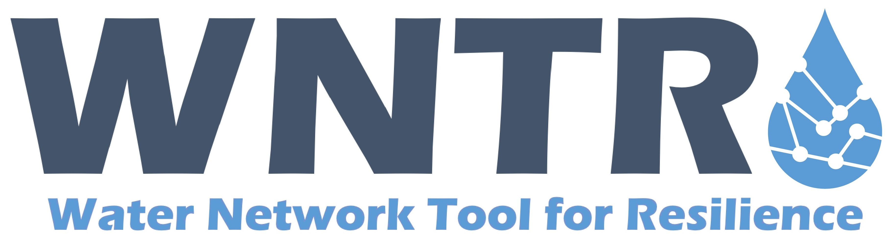

   
The Water Network Tool for Resilience (WNTR) documentation
has moved to https://usepa.github.io/WNTR/.

.. raw:: html

   <meta http-equiv="refresh" content="10;url=https://usepa.github.io/WNTR/">

This website will automatically redirect to https://usepa.github.io/WNTR/ in 10 seconds.

